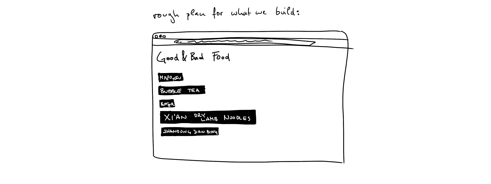

## Lab 1 - collecting dataset

[Quick Link to **How to collect data using Google Forms**](../collect-data-google-form)

#### todays agenda:
- [DOM, what is it?](#slides)
- [how a browser meets a website](#slides)
- [how a browser sees html](#slides)
- [css and js, endless metaphors](#slides)
- [review homework](#review-homework)
- [review JavaScript data structures](#review-javascript-data-structures)
- [Collect data with Google Forms](#collect-data-with-google-forms)
- [Transform Data](#transform-data)
- [Mini data visualization using JavaScript](#mini-data-visualization-using-javascript)

### slides

Here are the [slides](https://docs.google.com/presentation/d/1dgxYXxxQO4_PeyDetlwsARiS_HWgBY-FcvcbhxUUJGY/edit?usp=sharing) from today that include **browser, meet website**, **how a browser sees html** and **css and js, endless metaphors**

### review homework
a strategy to solve the exercise from this weeks Coding Foundation is:
1. link css and js
2. create box manually (html & css)
3. recreate box with js (createElement, className, appendChild)
4. create box on button click (function, getElementById, addEventListener)
5. create three boxes on button click (for loop)
6. read value of input (getElementById, value)


### review JavaScript data structures
[Here are slides](https://docs.google.com/presentation/d/1C7FiumimDZhSFaILnOj50oYgr7kE8_jRzD-bepwFHgw/edit?usp=sharing) I drew to explain JavaScript data structures.

(if you feel confident, you can skip this part)

It ends with [this exercise](http://cdv.leoneckert.com/json-nav) on navigating a JavaScript object. Let's try it.

### Collect data with Google Forms

[Here is a tutorial](../collect-data-google-form) guiding you through using [Google Forms](https://docs.google.com/forms/) to collect data and then turn it into a format that is easy to work with using [this trick](http://blog.pamelafox.org/2013/06/exporting-google-spreadsheet-as-json.html).

Today, we will all use the same dataset collected using this method. It is here for you to **copy and paste** (will update in class):

```json
placeholder
```

### Transform Data

Below is a function to transform the dataset we get from the Google Sheet. It's heavily commented for better understanding.

```javascript
// the function dates a data
// arrayn as an argument
function averageData(data){
  // new empty array to be filled
  // with data in new structure
  let newData = [];
  // assuming each data point has the same
  // keys/categories, we extract an array of them from the
  // first data point in the array
  // in class we changed it to the last element instead
  // as the first one did not have all the categories filled out
  // there is more thorough ways to do this, but for out purposes
  // now, this will be enough
  let keys = Object.keys(data[0]);
  // now we loop over the keys/categories
  for(let i = 0; i < keys.length; i++){
    // store the current key/category in
    // a variable:
    let key = keys[i];
    // now we will loop over each data point
    // in the data set, check if it has a value
    // for the key/category and add them to
    // a total sum variable
    // as well as count the occurences in order to
    // calulate the averae in the end
    let sum = 0;
    let num = 0;
    for(let j = 0; j < data.length; j++){
      let datum = data[j];
      // check if the key exists
      // for this datapoint
      if(key in datum){
        // add to sum
        sum += datum[key];
        // increase count
        num++;
      }
    }
    // now calculate the average
    let avg = sum/num;
    // make sure the value is a number
    // (some value might be strings)
    if(!isNaN(avg)){
      // create an object with both the average
      // and also the number of measurements that
      // went into the average
      let newDataPoint = {"name": key, "average": avg, 'numMeasurements': num};
      // add the new datapoint to the new data array
      newData.push(newDataPoint);
    }
  }
  // return everything when it is done
  return newData;
}
```

Example what this function does. If a dataset is:
```json
data = [
    {
        "category1": 3,
        "category2": 7,

    },
    {
        "category1": 2,
        "category2": 2,
    },

]
```
then, after using the function like
```javascript
let transformedData = averageData(data);
```
this
```javascript
console.log(transformedData);
```
will return
```json
[
    {
        "name": "category1",
        "average": 2.5,
        "numMeasurements": 2,

    },̨
    {
        "name": "category2",
        "average": 4.5,
        "numMeasurements": 2,
    },

]
```

### Mini data visualization using JavaScript



We code together in class to achieve this.
