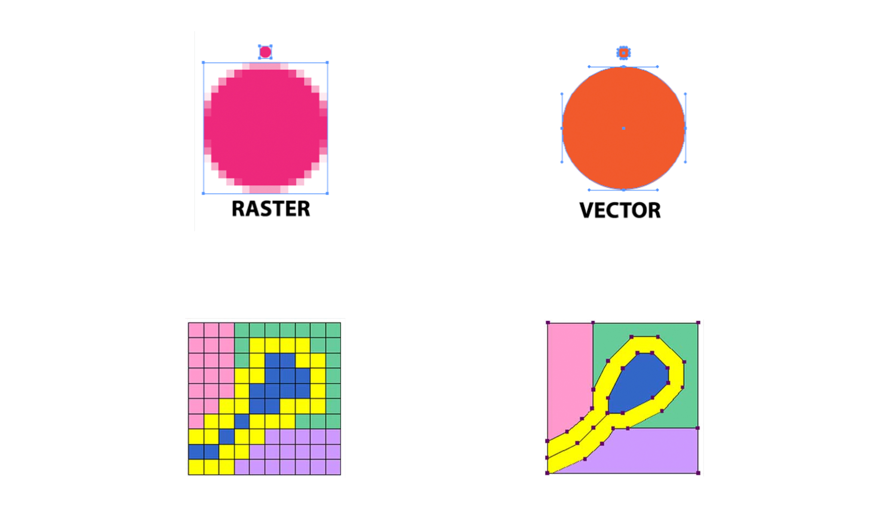
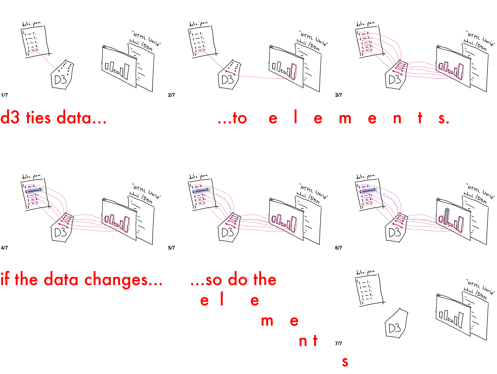
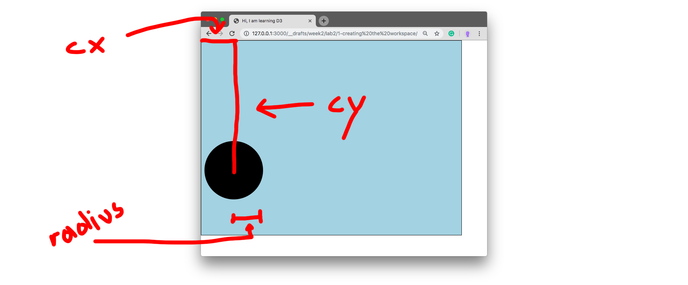
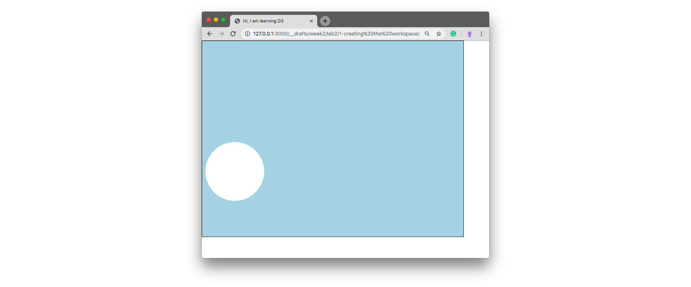
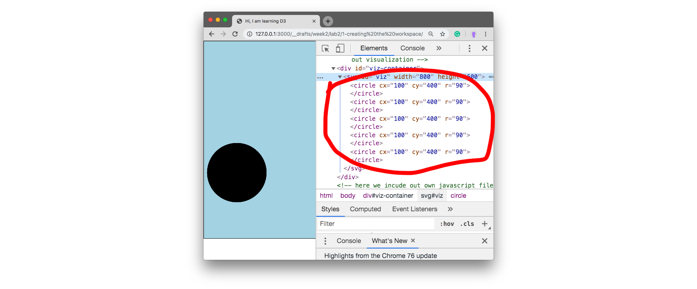
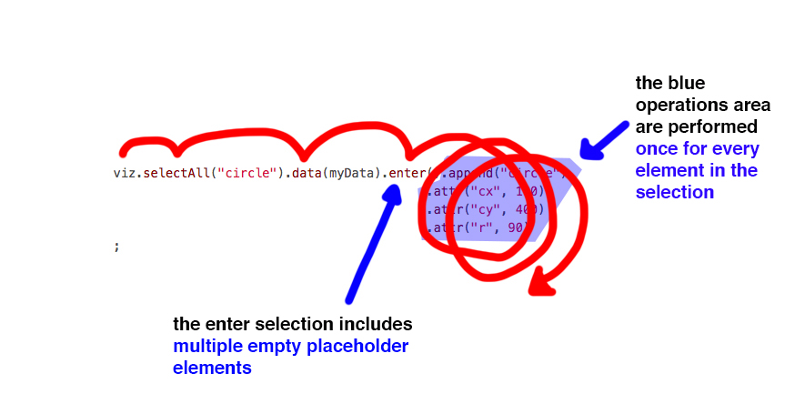
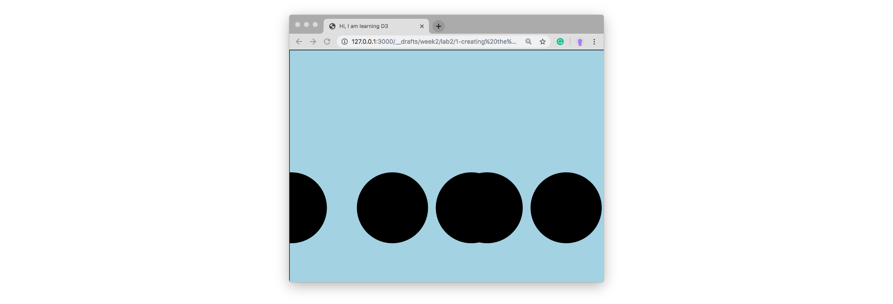
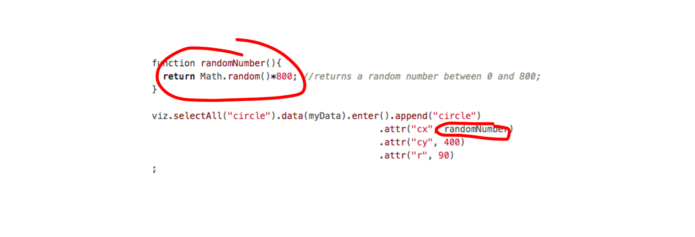
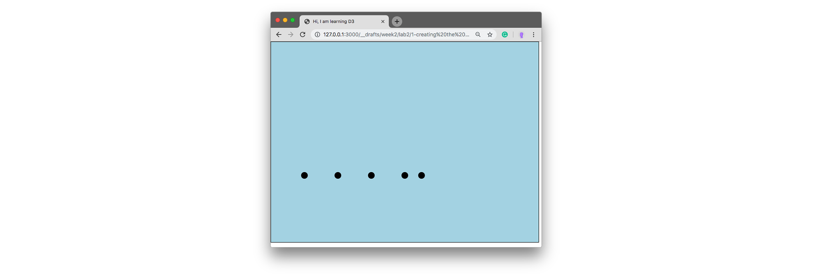

## Lab 2 - Welcome to D3.js

Today's Lab introduces concepts that are fundamental to learning D3. I am tempted to say it is **the most important lab**. Return to this page often and study it carefully.̨

#### today's agenda
- What is a library?
- Hi, D3!
  - pixels vs. SVG
  - examples
  - Data Driven Documents
- What you see when you see D3
  - Something dot something dot something semicolon
- [**Code**](#code)
  - Download working files
  - Part 1: The Start ([Video](https://drive.google.com/file/d/1Dd66zr1KI78zq3UINIn3caNIM0L993PW/view?usp=sharing))
    - selections, methods, attributes, return values, shapes
  - Part 2: The Whole Point ([Video](https://drive.google.com/file/d/1rwRxN5zNKUgtuVSqWC6rIyvX-5hisfzv/view?usp=sharing))
    - binding data to elements, "select nothing?!", enter-selection
  - Part 3: Jaws Drop ([Video](https://drive.google.com/file/d/1nKXh1oCVjZEptVlQHKlDnHnOcZrdtHSm/view?usp=sharing))
    - data functions
  - Part 4: Real Data ([Video](https://drive.google.com/file/d/1pK_Qq1DpcdmhzHsUDyjSCLtina9R4LL3/view?usp=sharing))
    - loading data in D3


### What is a library?

A library is a collection of function, methods, variables and objects that other people have written for us. If we import their code into our project, we can make use of all its functionality in our own code.

```HTML
<!DOCTYPE html>
<html>
  <head>
    <!-- here we "import" the code of D3 into a project -->
    <script src="https://d3js.org/d3.v5.min.js"></script>
  </head>
  <body>
  </body>
</html>
```


### Hi, D3!
##### pixels vs. SVG

pixels: each pixel in a given 2d set of pixels is defined. (e.g. jpg-files). pixel-based images loose quality when increasing their size too much, they get "pixelated".

SVG: we can think of SVG as code that describes shapes in relation to their surrounding. That means, graphics can be scaled as you please.  



FYI: Adobe Illustrator can [export graphics as SVG files](https://helpx.adobe.com/hk_en/illustrator/how-to/export-svg.html). [Browsers can read SVG within HTML](w3schools.com/graphics/svg_intro.asp), a little like this:

```HTML
<html>
  <head></head>
  <body>
    <svg width="100" height="100">
      <circle cx="50" cy="50" r="40" stroke="green" stroke-width="4" fill="yellow" />
    </svg>
  </body>
</html>
```


In D3, we use javascript to generate SVG.

```javascript
d3.select("#viz-container")
              .append("svg")
                .append("circle")
;
```
results in this on the page (more D3 below):
```html
<div id="viz-container">
  <svg>
    <circle></circle>
  </svg>
</div>
```

##### examples

[here are some](http://techslides.com/over-1000-d3-js-examples-and-demos)

[150 Privacy Policies](https://www.nytimes.com/interactive/2019/06/12/opinion/facebook-google-privacy-policies.html)

##### Data Driven Documents

D3 ties data to elements on the page. If the data changes, the elements adjust -> they are "driven" by the data.



### What you see when you see D3
something dot something dot something semicolon. In D3, you will see
```
long().chains().of().various().methods().seperated().by().dots();
```

## Code

### Download working files
The files are in the folder of this repo. You can download them [here](d3intro.zip).


I will upload a written walk through of the four parts in the evening after the Lab. i HIGHLY recommend watching the videos at least once before moving to text. Concepts we learn today are crucial to everything this semester. If you make yourself comfortable with them, you have a solif foundation to build up on.

- Part 1: The Start ([Video](https://drive.google.com/file/d/1Dd66zr1KI78zq3UINIn3caNIM0L993PW/view?usp=sharing))
  - selections, methods, attributes, return values, shapes
- Part 2: The Whole Point ([Video](https://drive.google.com/file/d/1rwRxN5zNKUgtuVSqWC6rIyvX-5hisfzv/view?usp=sharing))
  - binding data to elements, "select nothing?!", enter-selection
- Part 3: Jaws Drop ([Video](https://drive.google.com/file/d/1nKXh1oCVjZEptVlQHKlDnHnOcZrdtHSm/view?usp=sharing))
  - data functions
- Part 4: Real Data ([Video](https://drive.google.com/file/d/1pK_Qq1DpcdmhzHsUDyjSCLtina9R4LL3/view?usp=sharing))
  - loading data in D3


### Part 1: The Start
#### intro
In the folder you downloaded you see a html, css and js file. The are already linked together in the html. Please make note if the div with the id `viz-container` in the html, too. This is where we aim for our visualization to live in - we will use d3 to first create a `<svg></svg>` element inside the div, and then to create shapes that are bound to data.

Note also the little bit of code in the css file I provided. This is some of the styling we want to apply to the `<svg></svg>` element we are about to create. This will make more sense very soon.

Let's head to the `script.js` file.

#### selections
We have established that (pretty much) all we do in javascript starts with selecting something from the page/DOM/html world. Or at least create an element and use appendChild to bring it there. In the next steps we use D3's methods to both select an element from the DOM (the div with id `viz-container`) and create an element (`<svg></svg>` element) and append it to the DOM.

We start with the following:

```javascript
d3.select("#viz-container");
```
what's going on here? At first, we call out `d3`, think "*Hey D3, i need your help with something!*". After that we can use all of D3's methods in the dot-notated chain that is about to follow.

Next we use a D3 method: `d3.select`. In our case we are selecting an element using its ID; it's almost exactly the same as saying `document.getElementById("viz-container")`. Later, we will see that D3's "select" and "selectAll" methods do many more things, too.

**Currently selection**: `<div id="viz-container"></div>`

#### methods / append

After having caught 🎣 (I mean selected) and element, we do things to it. We set out to create and append an `<svg></svg>` element to the div. In D3, this is done in one step. Let's add this to the code we have written before.

```javascript
d3.select("#viz-container")
  .append("svg")
;
```
Okay, let's first note what happened visually, the semicolon `;` behind the first line disappeared, we jumped to the next line and added code with an indent, and finally we brought in the semicolon `;` again on the third line, completing a kind of bracket (this should remind of the `{...}` brackets in if-statements, function definitions or for-loops).

`append` is another method D3 gives us. We are using the dot-notation to string it to the previous statement. The whole things now reads "*Hey d3, select the div with id '#viz-container', then append an `<svg></svg>` element to it.*"

What's on the page now:
```html
<div id="viz-container">
  <svg></svg>
</div>
```
**Important**: After appending the `<svg></svg>` element, this element is now our selection, that means all we do subsequently in this bit of code will affect the `svg`, not the `div`.

**Selection changed**: `<svg></svg>`

Why the indent? There is two great reasons to indent. First, this way we can avoid endless code on one line - it's hard to read. Second, indentation can help us understand what happens in the code, that is, which selection our operations affect. In this case I indented to show that our selection changed (first, it was the div with id `#viz-container`, then it changed to the newly appended `<svg></svg>`). In the next step we will indent further to show that whatever we do subsequently will now concern the new selection (the `svg` element).

Why put the semicolon there? This is a syntax I like, it makes it easy to see what code belongs to what. It's like a block of code in conventional JavaScript code you might have seen. Additionally, it makes commenting in and out single lines easier while debugging. I encourage you to do it the same way in this class.

#### attributes

We don't see anything on our page yet, because both the div and the svg are invisible. Let's change that. Add this to your code:

```javascript
d3.select("#viz-container")
  .append("svg")
    .attr("id", "viz")
;
```

I indented yet again, because the method we added affects the `svg` that we only just appended. What did we do? We changed the attribute using D3's tool to do so: the `attr()` method. The `attr()` methods takes two arguments, first the name of the attribute we want to change, in our case `"id"`, next the value to which we want to set that attribute: `"viz"`.

Please check your page in the browser. You should now see a blue rectangle (the `svg`).

At last we modify two more attributes to change the dimensions of the `svg` element.

```javascript
d3.select("#viz-container")
  .append("svg")
    .attr("id", "viz")
    .attr("width", 800)    
    .attr("height", 800)
;
```

#### return values

We are almost done with this part, but let's add this to the very start of our code:

```javascript
let viz = d3.select("#viz-container")
              .append("svg")
                  .attr("id", "viz")
                  .attr("width", 800)    
                  .attr("height", 800)
;
```

Any dot-chain like the one we just created, in D3, returns the last element that is its selection. I am not sure how to word it better - you remember how in the beginning our selection was the `div` (id `#viz-container`)? And then, after appending the `svg` to it, that `svg` was our selection and all subsequent methods affected *it*, not the `div`? So in that case, the `svg` is the element that is being returned. That means that the variable `viz` now points to that very `svg` and we can use it to quickly refer to it.

To test this, let's pretend that "*oh i actually want to make another change to the `svg` now, I am no quite happy with its height*". (Of course we could modify the lines we just wrote, but it's good to know that we can also) write this below the code we already wrote:

```javascript
viz.attr("height", 600);
```

Try it! And see if you `svg` changes.

##
####  shapes

Before we work with data, let's see how we can create a shape in D3:

```javascript
viz.append("circle")
    .attr("cx", 100)
    .attr("cy", 400)
    .attr("r", 90)
;
```

This puts a circle element into the `svg` ("viz") and adds the mandatory attrites for circles `cx` (center x), `cy` (center y) and ` r` (radius). The DOM looks like this now:

```html
<div id="viz-container">
  <svg id="viz" width="800" height="600">
    <circle cx="100" cy="400" r="90"></circle>
  </svg>
</div>
```

and the rendered page:



###### add on:

if we had added this tho the start:

```javascript
let myCircle = viz.append("circle")
    .attr("cx", 100)
    .attr("cy", 400)
    .attr("r", 90)
;
```

...then `myCircle` would hold the selection if the circle now, and we could refer to it to modify it:

```JavaScript
myCircle.attr("fill", "white");
```

This changes the circle's filling to white.




### Part 2: The Whole Point

#### binding data to elements / "select nothing?!" / enter-selection

Let's continue, now we enter tricky territory. But if we understand this sub chapter, we have cracked D3's hardest nut.

As learnt before, D3 helps us to tie DOM elements to data. To see how this looks, let's make up data:

```javascript
let data = [4, 6, 8, 2, 9];
```

Next, watch this (I spread out the code here a little for visibility reasons):

```javascript
viz.selectAll("circle").data(myData).enter().append("circle")
                                          .attr("cx", 100)
                                          .attr("cy", 400)
                                          .attr("r", 90)
;
```

I know, I know. What. is. this? Try to read what is happening: "*viz something something data something, append circle*". We get the rough gist of what we working with, the viz which we append to, and data.

Let's check the DOM out:



Multiple circles. One for each data point.

Now, if you are confused by the `selectAll("circle")`, you are exactly right. We are selecting something that is not there yet, right? Yes. it's confusing. I will try to break it down:

`viz.selectAll("circle")` selects all circles on the page. It does, except, the selection it makes is **empty**, but it is still a selection.

D3 claims to bin data to elements. Next we bind data to our (empty) selection: `viz.selectAll("circle").data(myData)`. Now D3 considers what it has:
- 0 elements
- 5 datapoints

From that follows, we are missing 5 elements on the page to truthfully represent the data we got. That's why D3 creates these elements. So far, D3 doesn't know what kind of element, but at this point it creates placeholders for us to fill, it says "I know you want 5 data points to be represented on the page, i am waiting here for you instructions on what to do with them". These 5 placeholdes are the so called enter-selection - because it's about elements that are about to **ENTER** the visualization. We access this enter-selection by asking D3 for it:
```javascript
viz.selectAll("circle").data(myData).enter();
```

Okay, we are very far with this. What this is is a selection of multiple (not one like before) yet-to-be-filed placeholder elements. Puh! All that we subsequently do will be done **once for each datapoint**. It's a little bit like a for loop:



So for each of these empty not-yet-on-the-page placeholder slots, we append a circle and give attributes to that circle. Check out the DOM using the browser's inspect tool to see the circles

### Part 3: Jaws Drop
#### data functions

To see them separately on the page, we can give them random positions for now:

```javascript
function randomNumber(){
  return Math.random()*800; //returns a random number between 0 and 800;
}

viz.selectAll("circle").data(myData).enter().append("circle")
                                          .attr("cx", randomNumber)
                                          .attr("cy", 400)
                                          .attr("r", 90)
;
```

which results in this:




##### ...hold on, what just happened?...



We have just used a function right in the place where we normally define a number. We don't call this function, D3 does whenever it's needed (e.g. once in every loop above). Right? We only tell D3 hey d3, if you have have empty data placeholder elements to fill, then call this function. So, given that it's not us calling this function, but D3, let me tell you that D3 also passes information into this function. Much like when we call function like `console.log("HI");` - in this case the information we pass into the function is the word "HI". When D3 calls whatever function we put into this spot inside the attribute method, it passes on the very data point that it is currently iterating over.

```javascript
function justCecking(datapoint){
  console.log(datapoint);
  return Math.random()*800; //returns a random number between 0 and 800;
}

viz.selectAll("circle").data(myData).enter().append("circle")
                                          .attr("cx", justCecking)
                                          .attr("cy", 400)
                                          .attr("r", 90)
;
```

Consider this. Now we made a function that just console.logs whatever D3 passes it when it calls it. ...to keep things as they were, we stick to returning a random value, too, for the circle's position.

The page looks the same, but on the console we see this:


Do you notice what this is? These are our data points as we made them up above.

Do you realize what this means? Instead of returning a random value, we can return this data point to actually **visualize data!!**

```javascript
function justCecking(datapoint){
  console.log(datapoint);
  return datapoint*50 //returns value of the datapoint multiplied with 50
}

viz.selectAll("circle").data(myData).enter().append("circle")
                                          .attr("cx", justCecking)
                                          .attr("cy", 400)
                                          .attr("r", 10)
;
```

Note, I also changed the radius of the circles to ``10``. And this is how it looks. Now the circles position according to the data that is bound to them:



### Part 4: Real Data
#### loading data in D3

From now on, we work with data files. Rather than pasting a long JavaScript object of data into our code, we keep a separate file in our project folder. Data comes in many different formats, we aim to have `.json` or `.csv` files. In the folder you downloaded, there is a `data.json` file.

To "load" it, we first create a function to deal with incoming data. This function will be called once the data is loaded (as we specify below). That's why we will do all subsequent code inside this function (for now) where the data is available.

```javascript
function gotData(newdata){   // this function expects to be passed data
  console.log(newdata);   // print it to the console to verify

  // in here we can now work with the new data
  //
  // e.g. viz.selectAll("circle").data(newdata).ent.......


}
```

After defining the function, we tell D3 to load the json file, and then pass its content to the function we created:

```javascript

d3.json("data.json").then(gotData)

```


