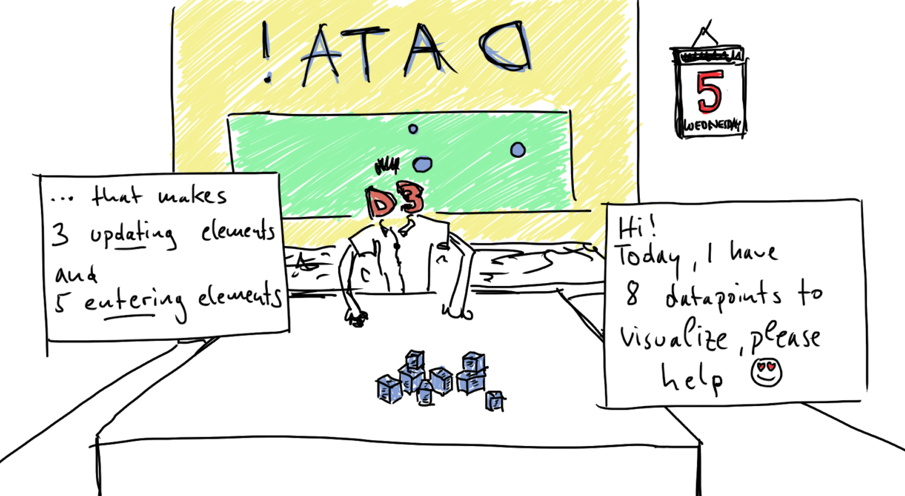
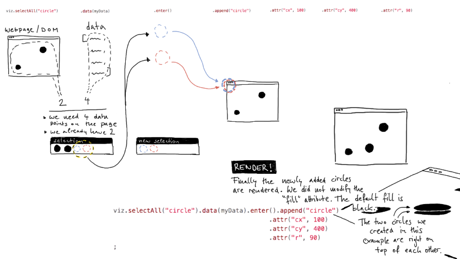
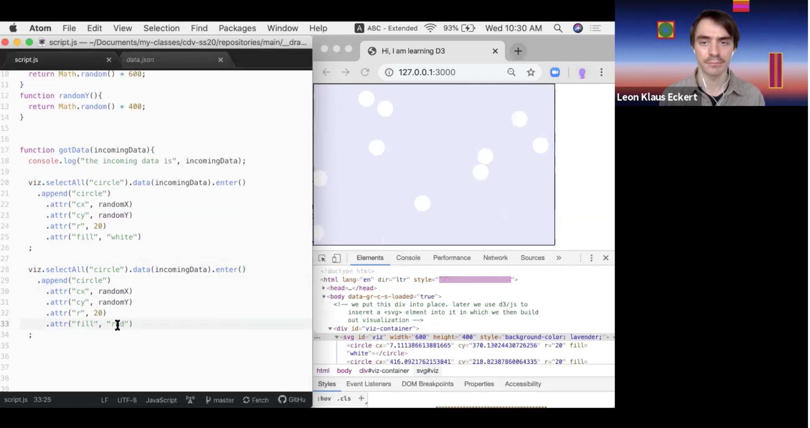
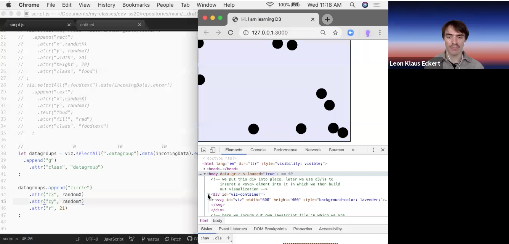
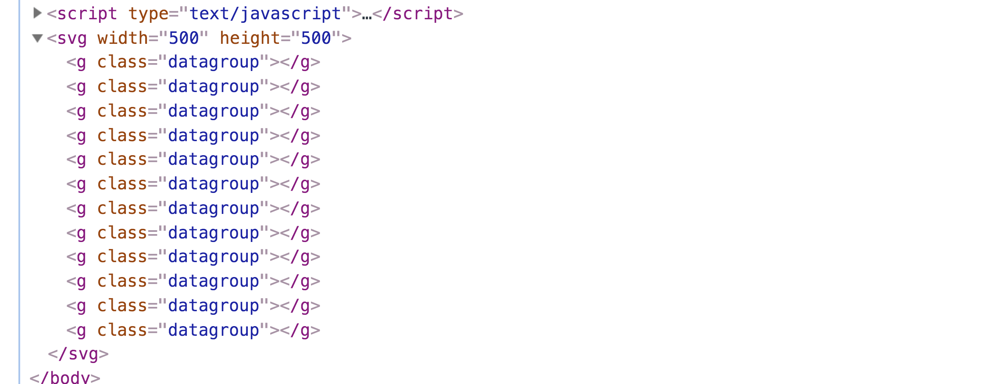
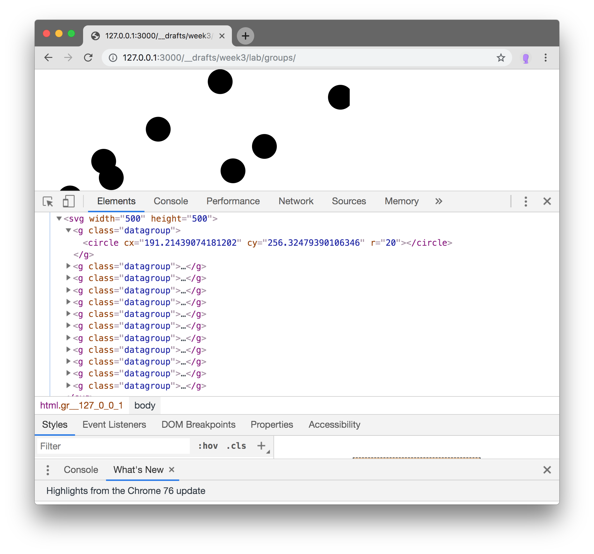
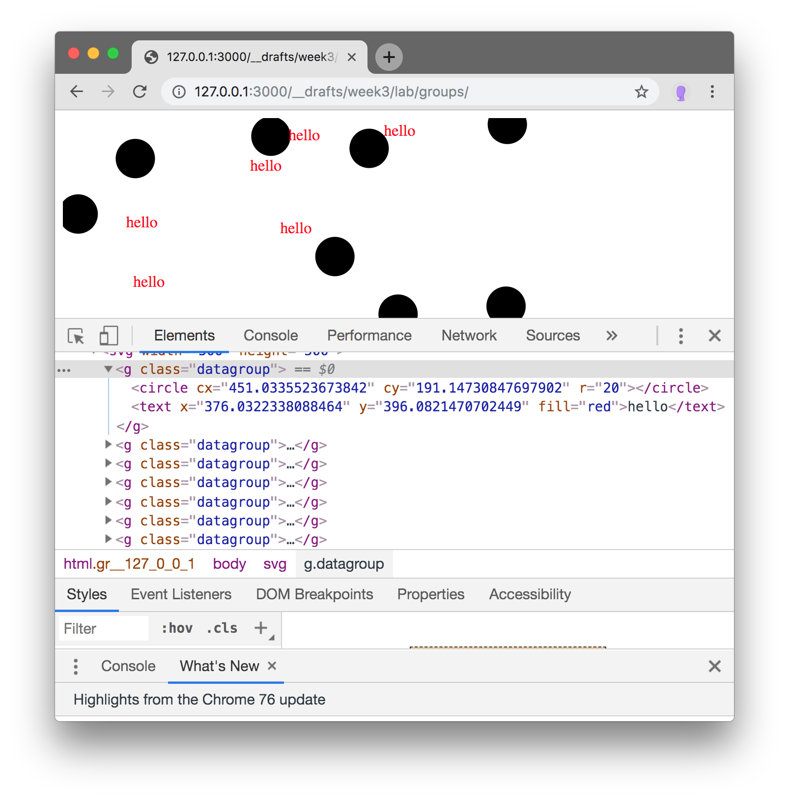
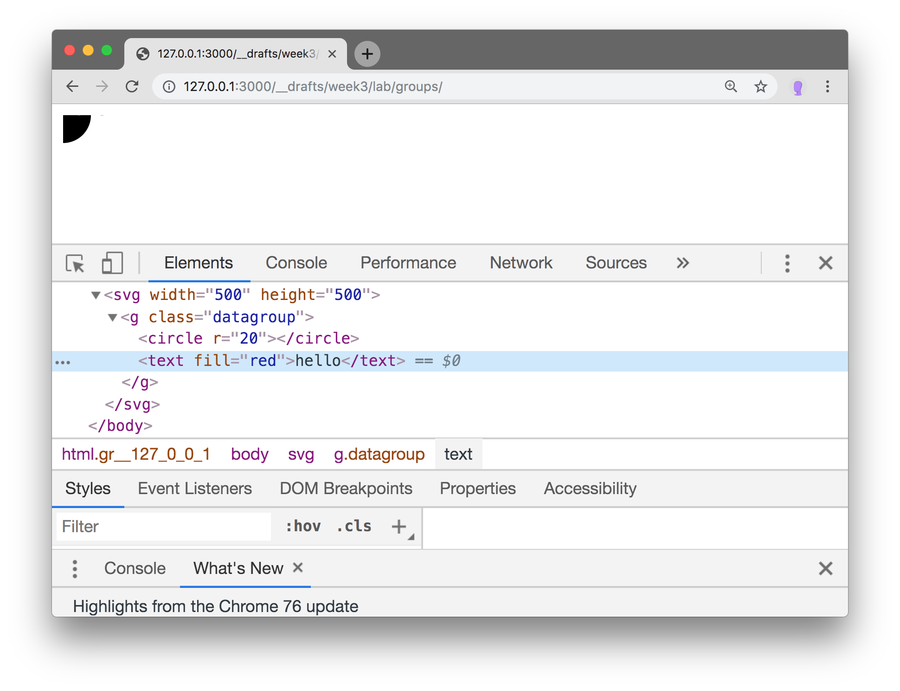
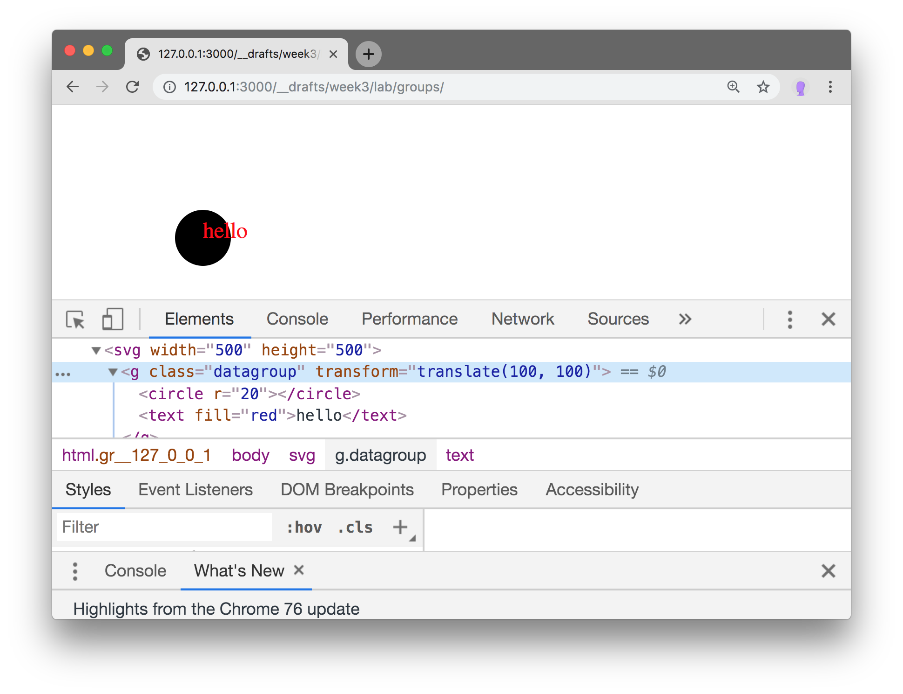
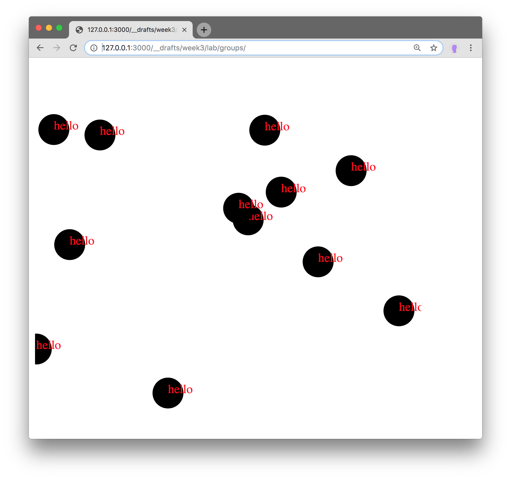

## Lab 3 - Meet D3.js II

#### today's agenda
- [useful resources](../../other/resources)
- Binding Data to Elements: Various Scenarios
  - a **no-code** introduction to enter-, update-, and exit-selections ([slides](https://docs.google.com/presentation/d/1gc3dyrZ247QoJkNvZ3n0a9nzdSABaIN-NfaJI7eqHs0/edit?usp=sharing))
- incoming data: the enter-selection in detail ([slides](https://docs.google.com/presentation/d/1fHRUWabjKquzlmHQjOiJREC6wDlM7VOc6nb5VEKw8eI/edit?usp=sharing))
- Layla's Homework Discovery I
- loading data and data functions: 2 "*rules*" to avoid errors
- Videos
  - [Video 1](https://drive.google.com/file/d/19VkCHeKSUWx4vwjOKudiq83lS2-aqfbq/view?usp=sharing) (18 min):
    - Classes: why & how we should use them
  - [Video 2](https://drive.google.com/file/d/1vFN59-duZ-XCNmit3oITcEWSBtX3DkfZ/view?usp=sharing) (26 min):
    - Groups: Structure
Layla's Homework Discovery II (solved with classes)


#### a **no-code** introduction to enter-, update-, and exit-selections

[**LINK TO SLIDES**](https://docs.google.com/presentation/d/1gc3dyrZ247QoJkNvZ3n0a9nzdSABaIN-NfaJI7eqHs0/edit?usp=sharing)




#### incoming data: the enter-selection

[**LINK TO SLIDES**](https://docs.google.com/presentation/d/1fHRUWabjKquzlmHQjOiJREC6wDlM7VOc6nb5VEKw8eI/edit?usp=sharing)



**important add-on**: in D3 we work with selections and modify them in dot-notated chains of methods. You have seen this by now. Let's hold the thought that
- if a selection is **one** element, this element will be modified by all subsequent methods;
- if a selection contains **multiple** elements, subsequent modifications are automatically applied to each of them individually (d3 loops for us, we **do not need to write for loops anymore**)

#### loading data and data functions: 2 "*rules*" to avoid errors
We can apply the two following rules safely to avoid errors.

1) only use the variable name `incomingData` inside our `gotData` function:

```js

// outside gotData, we don't use incomingData

function gotData(incomingData){
  // in here we can use incomingData
  viz.selectAll(".datapoint").data(incomingData).enter()
    ...

}

// D3 passes loads the data, and then
//passes it into out gotData functions.
// Inside it we "receive" it and give it the name "incomingData"
d3.json("data.json").then(gotData);
```

2) data function always receive data. We ALWAYS give this data the names `d` and `i`:

```js
// the following three data function definitions
// exemplify how every data function should look:

function xPosition(d, i){ // <-- receive the datapoint and index, give it the names d and i
  return d.fictionalValue;
}
function yPosition(d, i){ // <-- receive the datapoint and index, give it the names d and i
  return i * 30;
}
function radius(d, i){ // <-- receive the datapoint and index, give it the names d and i (even if we don't end up using it, it doesn't hurt)
  return 20;
}

// here we actually USE the data functions
function gotData(incomingData){
  viz.selectAll(".datapoint").data(incomingData).enter()
    .append("circle")
      .attr("cx", xPosition)
      .attr("cx", yPosition)
      .attr("r", radius)
  ;

}
```


##### classes

Please watch this [video](https://drive.google.com/file/d/19VkCHeKSUWx4vwjOKudiq83lS2-aqfbq/view?usp=sharing) before you read through the notes below.



Why assign classes?
- to easily style elements in our CSS
- to use the class name in `selectAll()` methods and be more explicit.

Classes are just another attribute of an element. We can assign a class using the `attr()` method:

```javascript
selection.attr('class', 'bar');
```
this assigns the class name '.bar' to each element in the selection.

###### avoid errors:

A simple "*rule*" to avoid errors: select by classname, assign same class name to the elements you create:

```js
// note, in selectAll we need the "." to select elements by classname
viz.selectAll(".CLASSNAME").data(myData).enter()
  .append( "circle" or "g" or "rect" etc. ) // append an element of your choice

    .attr("class", "CLASSNAME") // assign the SAME CLASSNAME as you gave selected 2 lines above.

    .attr(...) // assign other...
    .attr(...) // ... attributes as...
    .attr(...) // ... you wish
;
```


###### alternative/advanced method: ``classed()``
This allows to set multiple classes at once as well as toggle classnames on and off. See [this section](https://github.com/d3/d3-selection#selection_classed) in D3's documentation.


#### Groups

Please watch this [video](https://drive.google.com/file/d/1vFN59-duZ-XCNmit3oITcEWSBtX3DkfZ/view?usp=sharing) before reading through the notes below.




Just like on a regular HTML page where the `div` element is extensively used, in a SVG graphic we can use the `<g>` element to group others.

###### Why group elements?
- maintain order and structure in the visualization
- create complex shapes expressing more varieties of data
- move/position many shapes at once
- link text to shapes

Think of this visualization by [Giorgia Lupi](http://giorgialupi.com/dear-data), the grouping here is very obvious. Each shape consists of multiple smaller shapes each expressing different aspects of the same datapoint ("one goodbye"):


###### Okay, convinced, show me how to group

(after using D3 to append an `svg` element to the document's body and keeping a reference named `viz` to that element, we can do the following)
```JavaScript
let groupelements = viz.selectAll(".datagroup").data(myData)
  .enter()
    .append("g")
    .attr("class", "datagroup")
;
```

This selects all elements of the class ".datagroup" - most likely an empty selection, but by now we know [how that part works](https://docs.google.com/presentation/d/1fHRUWabjKquzlmHQjOiJREC6wDlM7VOc6nb5VEKw8eI/edit?usp=sharing). The entering, empty placeholder elements that result from this are ours to modify after using the `.enter()` method. For each empty placeholder, we append a `"g"` (group) element. Finally we assign a class name to the group. Please take a look at this in your browser. What you should see is something like this:



For each datapoint, a `g` element has been appended to the svg element. Each of them has the same class. On the page, there is nothing yet, because g elements are, like divs, invisible - their purpose is to be used to create structure.

In above code snippet, you can see that we *saved* out selection (the groups) in the variable name "groupelements". We can use this selection whenever we want to do something to the groups.

Let's append circles to the groups:

```javascript
groupelements.append("circle")
    .attr("cx", randomX)
    .attr("cy", randomY)
    .attr("r", 20)
;
```

first off, caution, I am not going to explain or write out the two data functions (randomX and randomY) I am using here because we have gone through this before. What is important here is that we work with a selection (`groupelements`) and *do things to it* (`append(circle)`). Since our selection contains multiple elements (all the `g` groups), the `append` methods appends a circle to each of these groups. See it reflected on page and Developer Tool's Elements tab:



CAUTION: don't stop reading here, I am intentionally withholding a crucial piece of information, you know my ways. It will help us to understand a certain concept about groups...read on!

###### next, let's add text to our group

```javascript
groupelements.append("text")
    .attr("x", randomX)
    .attr("y", randomY)
    .text("hello")
    // .text(getText) // I am putting this line here for you to see that you could also use a data function to retrieve text that comes from your actual data point.
    .attr("fill", "red")
;
```

Take look on the page:



First off, great! We have grouped different elements! But then, look at their position! We don't have anything of the fact they are a group, things are all over the place and texts cannot be associated with corresponding circles.

This is because we position the shapes individually. The idea is to only position them relative to their group, then position the group in space instead. In Processing or p5js this is similar to a push, pop, translate system.  

To illustrate this, I will reduce my dataset to one data point for now. Then I take away the position attributes in both circles and text elements:

```javascript
groupelements.append("circle")
    .attr("r", 20)
;
groupelements.append("text")
    .text("hello")
    .attr("fill", "red")
;
```

now the visualization look like this.



Note: the text is just out of frame at this point, but in the developer tools we can see it is on the page technically.

Here comes sad news: we cannot position the group element using the famililar `.attr("x", ...)`. Instead we need to use the [transform attribute](https://developer.mozilla.org/en-US/docs/Web/SVG/Attribute/transform) which will look considerably more messy. The good news, well, it will get us to where we want to get.

`transform` can not only position ("translate") things, but also rotate, scale, skew and some other things. In `.attr("x", ...)`, "x" is the attribute *property* and we assign a value for that property. Using `.attr("transform", ...)` means that "transform" is the property and one of either "translate"|"scale"|"rotate"|etc. is the value!!! This is weird, you might not realize yet why. Here it comes. To repeat: the group contains two shapes (circle and text) that are positioned at the origin. Now we will use transform's translate method to position the containing group:

```javascript
groupelements.attr("transform", "translate(100, 100)");
```

done. The page looks like this now:



Good news, the shapes (circle and text move together). The code is even sort of readable. However it can get messy when we use dynamic position values. I will do my best here to keep it understandable. I create a new function that returns a string to be used by "translate":

```JavaScript
function randomTranslate(){
  let x = Math.random()*500;
  let y = Math.random()*500;
  return "translate(" + x + "," + y + ")";
}
```

We are constructing a string of the pattern `"transform(x,y)"`. Now we use this function to move our group:

```javascript
groupelements.attr("transform", randomTranslate);
```

and to see the randomness and *groupness* I *switch* on more data points again:



Great! Now our group members stay together. We can still access actual data values in above `randomTranslate` function. Also, we can still make use of the familiar "cx", "cy", "x" and "y" attributes to position the shapes relative to their own groups.

This might overwhelm at this point, but look how few lines the whole code needs so far - the same code can be used to draw 1, 3, 7, or 100000 data points:

```javascript
function randomTranslate(){
  let x = Math.random()*500;
  let y = Math.random()*500;
  return "translate(" + x + "," + y + ")";
}

function gotData(incomingData){
  // create svg
  let viz = d3.select("body")
    .append("svg")
      .attr("width", 500)
      .attr("height", 500)
  ;
  // append groups
  let groupelements = viz.selectAll(".datagroup").data(incomingData)
    .enter()
      .append("g")
      .attr("class", "datagroup")
  ;
  // append circles
  groupelements.append("circle")
      .attr("r", 20)
  ;
  // append text
  groupelements.append("text")
      .text("hello")
      .attr("fill", "red")
  ;
  // position groups (this could also be part of the
  // section where we created the groups in the first place).
  groupelements.attr("transform", randomTranslate);
}

// get data
d3.json("data.json").then(gotData);
```

#### text

you learned how to create and append text to svg elements above. Here is a bit more info:

`<text>` is a standard svg element which means we create it just the same way as any other shape so far. To see what attributes it needs (assuming we somehow have to treat it differently than a circle for example), we just check any [reference online](https://developer.mozilla.org/en-US/docs/Web/SVG/Element/text). It seems to need `x`, `y`, and content (to add content we use D3's `.text()` method as you see in the previous section).
